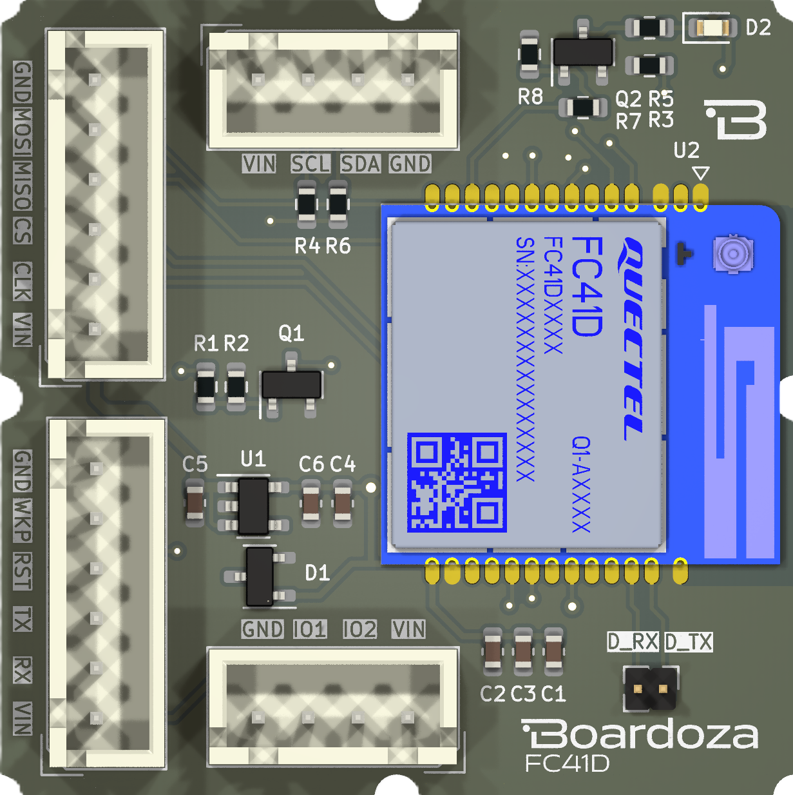
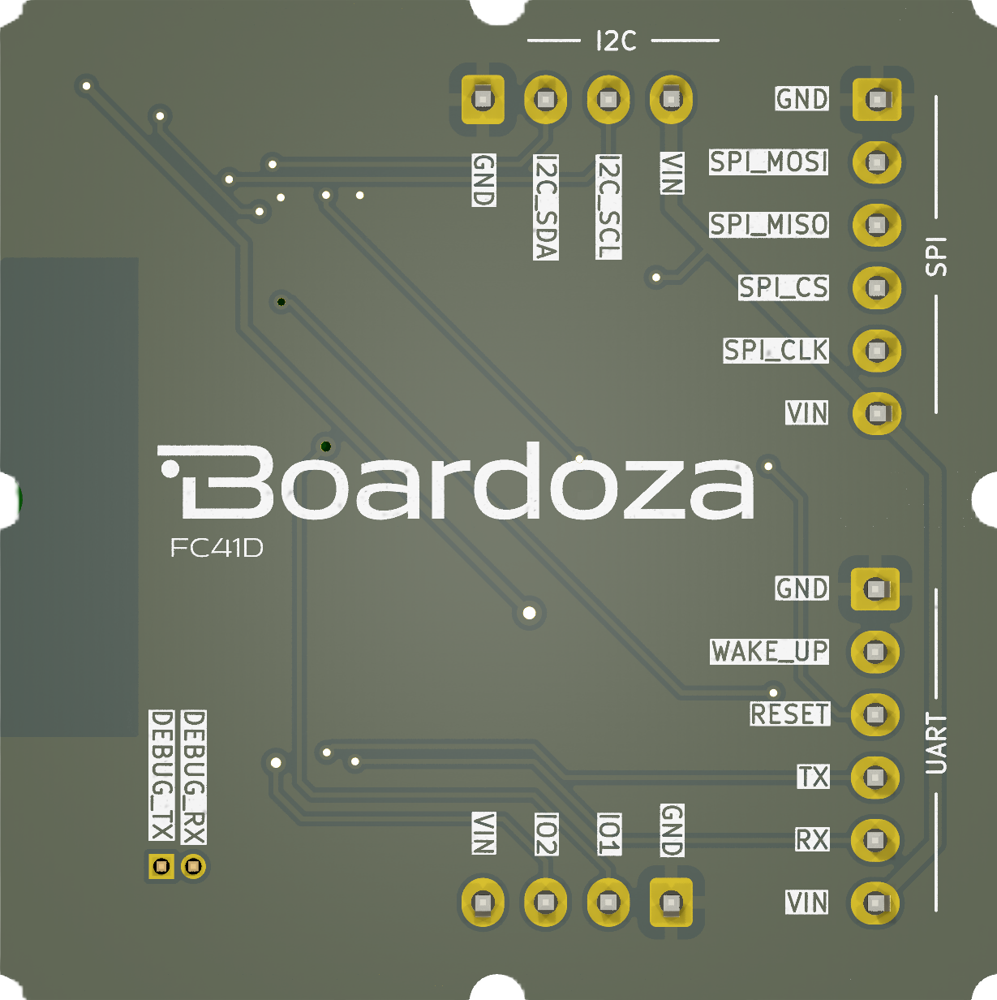

# Boardoza Quectel FC41D Wi-Fi & Bluetooth Module Breakout Board

The **Boardoza Quectel FC41D Module** is a versatile wireless connectivity solution that combines **Wi-Fi (802.11 b/g/n)** and **Bluetooth Low Energy (BLE 5.2)** protocols into a single compact module. Designed for **IoT, smart home, and industrial wireless applications**, this module provides seamless integration with a wide range of microcontrollers through **UART, SPI, and I2C** interfaces.

Operating in the **2.4 GHz frequency band**, the FC41D ensures wide compatibility and reliable performance in common network environments. Built-in security protocols such as **WPA-PSK/ WPA2-PSK/ WPA3-SAE** help maintain secure wireless communication.

## [Click here to purchase!](https://www.ozdisan.com/maker-ve-iot-urunleri/boardoza/boardoza-modulleri/FC41D-BREAKOUT-BOARD/1065569)

|Front Side|Back Side|
|:---:|:---:|
| | |

---

## Key Features

- **Dual Protocol Support:** Integrates both Wi-Fi (802.11 b/g/n) and Bluetooth 5.2 Low Energy.
- **Flexible Interface Options:** Offers **UART**, **SPI**, and **I2C** for easy connection with various host systems.
- **Secure Wireless Communication:** Supports **WPA-PSK/ WPA2-PSK/ WPA3-SAE** standards for protected data exchange.
- **Standard Frequency Range:** Operates in the **2.4 GHz** ISM band, widely used in IoT and wireless consumer products.
- **Optimized for IoT:** Ideal for devices requiring low-to-moderate data transfer rates such as smart sensors, wearables, and automation systems.

---

## Technical Specifications

**Model:** Quectel FC41D  
**Input Voltage:** 5V  
**Voltage Input Type:** Multiple 4–6 pin headers (standard 2.50mm pitch)  
**Functions:** Wi-Fi & Bluetooth Module  
**Wi-Fi Protocols:** IEEE 802.11 b/g/n  
**Bluetooth Protocols:** BLE 5.2  
**Frequency Band:** 2.4 GHz ISM band  
**Interface:** I2C, UART, SPI  
**Security Protocols:** WPA-PSK/ WPA2-PSK/ WPA3-SAE
**Operating Temperature:** -40°C to +85°C  
**Board Dimensions:** 40mm x 40mm  

---

## Board Pinout

### **Debug Connector**

| Pin Number | Pin Name | Description |
|:---:|:---:|---|
| 1 | D_TX | Debug TX Input |
| 2 | D_RX | Debug RX Input |

### **( J3 ) SPI Connector**

| Pin Number | Pin Name | Description |
|:---:|:---:|---|
| 1 | VIN | Voltage Input |
| 2 | CLK | SPI Clock Pin |
| 3 | CS | Chip Select Pin |
| 4 | MISO | SPI MISO Pin |
| 5 | MOSI | SPI MOSI Pin |
| 6 | GND | Ground |

### **( J4 ) UART Connector**

| Pin Number | Pin Name | Description |
|:---:|:---:|---|
| 1 | VIN | Voltage Input |
| 2 | RX | UART Receive Pin |
| 3 | TX | UART Transmit Pin |
| 4 | RST | Reset Pin |
| 5 | WKP | Wake-Up Pin |
| 6 | GND | Ground |

### **( J5 ) I2C Connector**

| Pin Number | Pin Name | Description |
|:---:|:---:|---|
| 1 | VIN | Voltage Input |
| 2 | SCL | I2C Serial Clock Pin |
| 3 | SDA | I2C Serial Data Pin |
| 4 | GND | Ground |

---

## Board Dimensions

---

## Step Files

[Boardoza Quectel FC41D.step](./assets/Quectel_FC41D%20Step.step)

---

## Datasheet

[Quectel FC41d Datasheet.pdf](./assets/Quectel%20FC41D%20AT%20Commands%20Manual%20V1.0-1.pdf)

---

## Version History

- V1.0.0 - Initial Release

---

## Support

- If you have any questions or need support, please contact <support@boardoza.com>

---

## License

Shield: [![CC BY-SA 4.0][cc-by-sa-shield]][cc-by-sa]

This work is licensed under a
[Creative Commons Attribution-ShareAlike 4.0 International License][cc-by-sa].

[![CC BY-SA 4.0][cc-by-sa-image]][cc-by-sa]

[cc-by-sa]: http://creativecommons.org/licenses/by-sa/4.0/
[cc-by-sa-image]: https://licensebuttons.net/l/by-sa/4.0/88x31.png
[cc-by-sa-shield]: https://img.shields.io/badge/License-CC%20BY--SA%204.0-lightgrey.svg

